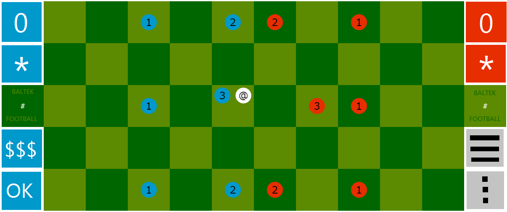

# Introduction

This document collects ideas for adaptation of BALTEK to smartphone and more generally to tactile screen.

# Screen

Hereafter is a possible design for the screen.

# Boxes as buttons or counters

* Score and bonus counters, as well as action buttons are using the unused boxes of the football Field. This way the screen surface is optimally used.
* In order to keep some decoupling between the Rules-Engine and the Presenter, the Rules-Engine ensures to provide the coordinates of 4 free boxes on the left, and 4 free boxes on the right. 
* The name "BALTEK" is discretely displayed in the 2 "#" Field boxes.
* The player only needs to touch a box, without trying to precisely select either the Ball of a Footballer. Indeed, most of the time, in a box, there just one selectable Footballer. When the player can select either the Ball or a Footballer :
  * the first touch selects the Ball;
  * the second touch selects the Footballer;
  * the last touch unselect the Footballer.
* The "$$$" box has two roles : 
  * display the remaining credits;
  * cancel/undo the moves of the active turn.
* The "*" box has two roles :
  * display the remaining bonus;
  * select the bonus ; the selected status is rendered by the yellow colour, also used for the selected Field box.
* The "OK" box acts as a button used for confirm the active turn.
* The "$$$" and the "OK" boxes are displayed on the side of the active player, and using the colour of the active player.
* The two remaining boxes, in grey colour, "///" and "..." are respectively used for a general menu (IA levels or remote player request; help; rules; about; language settings; display coordinates) and for a few quick actions (e.g. new game).  
* Another option is that:
  *  "$$$" and "*" boxes are just counters. 
  * The "cancel/undo" and "select bonus" are available from the "..." quick menu.
* The grey boxes are display on the side of the non-active player.

# Markers on footballers 

* Each footballer, says "F" is displayed with his/her actual capabilities:
  * ".F" : means "F" can kick the ball on this turn.
  * "F." : means that "F" can run on this turn.
  * ".F." : means that "F" can do both on this turn: kick the ball and run.
  * "F" : means that "F" can do nothing on thus turn.
* Symbolically, the dot before of the digit is like the ball in front of the footballer.
* Symbolically, the dot after the digit is like some pushing force behind the footballer.
* Such feature can be implemented both in the desktop and smartphone configurations.

# BALTEK as an Android App

After browsing forum, it seems rather easy to transform an HTML5/Javascript game into a standard Android app. A few tools can automate the required packaging.