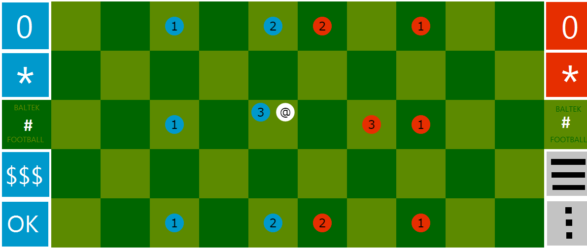

# Design for smartphone

## Introduction

This document collects ideas for adaptation of BALTEK to smartphone and more generally to tactile screen.

## Screen

Hereafter is a possible design for the screen.

## Boxes as buttons or counters

- Score and bonus counters, as well as action buttons are using the unused boxes of the football Field. This way the screen surface is optimally used.
- In order to keep some decoupling between the Rules-Engine and the Presenter, the Rules-Engine ensures to provide the coordinates of 4 free boxes on the left, and 4 free boxes on the right.
- The name "BALTEK" is discretely displayed in the 2 "#" Field boxes.
- The player only needs to touch a box, without trying to precisely select either the Ball of a Footballer. Indeed, most of the time, in a box, there just one selectable Footballer. When the player can select either the Ball or a Footballer :

  - the first touch selects the Ball;
  - the second touch selects the Footballer;
  - the last touch unselect the Footballer.

- The "$$$" box has two roles :

  - display the remaining credits;
  - cancel/undo the moves of the active turn.

- The "*" box has two roles :

  - display the remaining bonus;
  - select the bonus ; the selected status is rendered by the yellow colour, also used for the selected Field box.

- The "OK" box acts as a button used for confirm the active turn.
- The "$$$" and the "OK" boxes are displayed on the side of the active player, and using the colour of the active player.
- The two remaining boxes, in grey colour, "///" and "..." are respectively used for a general menu (IA levels or remote player request; help; rules; about; language settings; display coordinates) and for a few quick actions (e.g. new game).
- Another option is that:

  - "$$$" and "*" boxes are just counters.
  - The "cancel/undo" and "select bonus" are available from the "..." quick menu.

- The grey boxes are display on the side of the non-active player.
